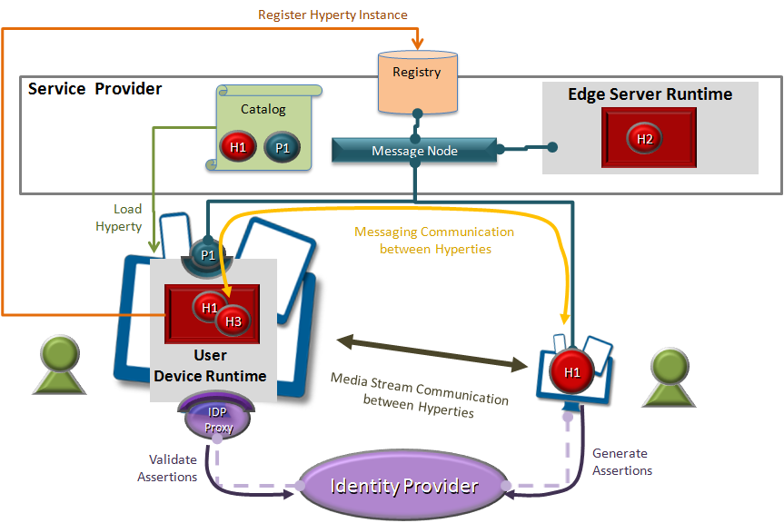

reTHINK Framework Architecture
---------------

The reTHINK Framework is built around [Hyperlinked Entities (hyperties)](hyperty.md) that leverages the protocol-on-the-fly (ProtoFly) concept to avoid creating or modifying standard network protocols, but moving instead towards an API based flat service architecture. The reTHINK project envisages a global network of interconnected hyperties that are executed in web runtime environment on end-user devices or edge-network servers. The reTHINK Framework functions are based on a series of such hyperties that are generated by the service provider, and are downloaded to the users’ end-users or edge-network servers. The hyperty modules represent a set of services that are stored in a Catalogue. The instantiated versions of these hyperties are registered in a Registry, which represents authenticated users who are available for in-coming connectivity service. Therefore, the Registry serves as a location manager and is used for user discovery. A user can be a human being, a group or, a connected object (e.g. building room with sensors). Users have independent identities that are maintained by Identity Providers (IdPs) that are independent organizations. The users’ identities are based on their personal and confidential data, which is verified by other solicited data, but such private information is only divulged under user-controlled privacy rules.

In order to setup your own reTHINK Framework, you should install the following components (docker images available):

-	the [Hyperty Catalogue](https://github.com/reTHINK-project/dev-catalogue)
-	the [Hyperty Domain Registry](https://github.com/reTHINK-project/dev-registry-domain)
-	any of the three available Message Nodes: the [Vertx Message Node](https://github.com/reTHINK-project/dev-msg-node-vertx), [Matrix](https://matrix.org/) or [NodeJS](https://nodejs.org/en/).
